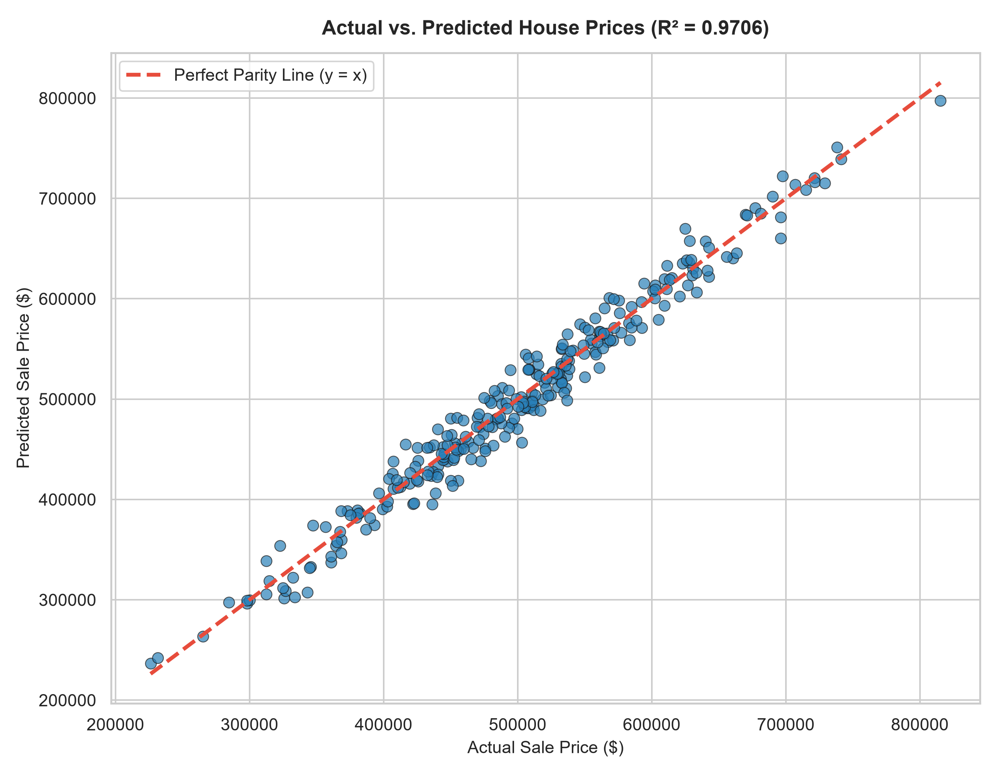
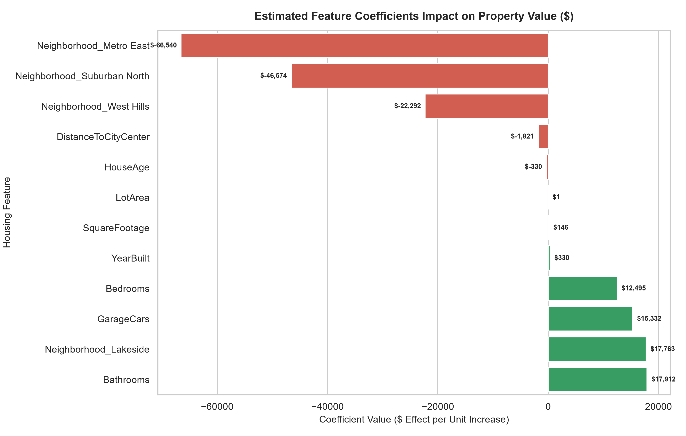
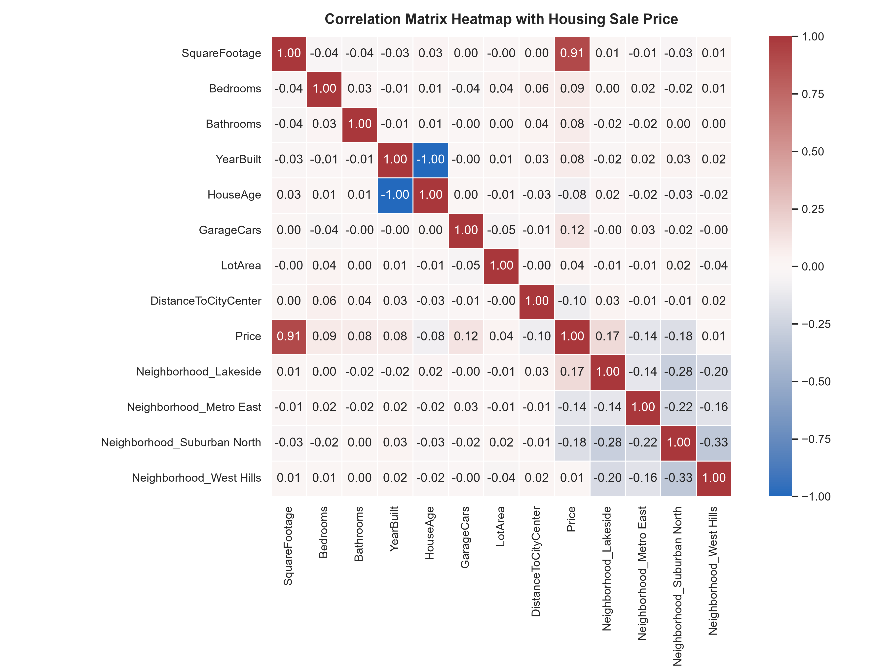
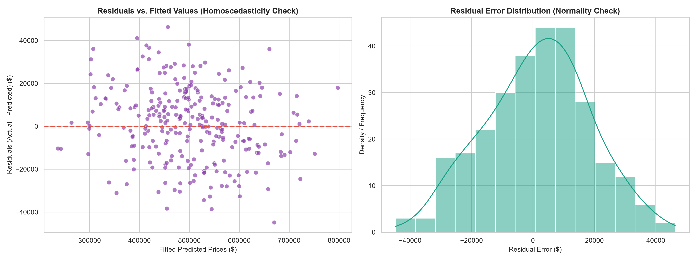

# 🏡 Predicting House Prices with Linear Regression & Regularization

**Organization:** Oasis Infobyte (OIBSIP)  
**Track:** Data Analytics (Level 2 • Task 1)  
**Author:** Narendra Adane

---

## 📌 Project Overview
This project formulates, trains, and evaluates econometric regression models predicting residential property transaction values based on physical and geographic attributes. The pipeline benchmarks Ordinary Least Squares (OLS) against Ridge ($L_2$) and Lasso ($L_1$) regularized estimators.

---

## 📁 Repository Structure
```text
├── charts/
│   ├── actual_vs_predicted_prices.png
│   ├── feature_coefficients_impact.png
│   ├── housing_correlation_heatmap.png
│   └── residual_analysis_diagnostics.png
├── data/
│   └── housing_data.csv
├── notebooks/
│   └── house_price_prediction.ipynb
├── report/
│   └── findings_and_recommendations.md
├── ml_core.py
├── run_regression.py
├── requirements.txt
└── README.md
```

---

## 📈 Visualizations & Key Charts

### 1. Actual vs. Predicted Parity Plot


### 2. Feature Marginal Coefficients ($ Impact)


### 3. Housing Correlation Matrix Heatmap


### 4. Residual Diagnostics (Homoscedasticity & Normality)


---

## 📄 Valuation Report
For the complete econometric coefficient analysis and model benchmarking, see **[report/findings_and_recommendations.md](report/findings_and_recommendations.md)**.

---

## 🚀 How to Run Locally
```bash
pip install -r requirements.txt
python run_regression.py
jupyter notebook notebooks/house_price_prediction.ipynb
```
